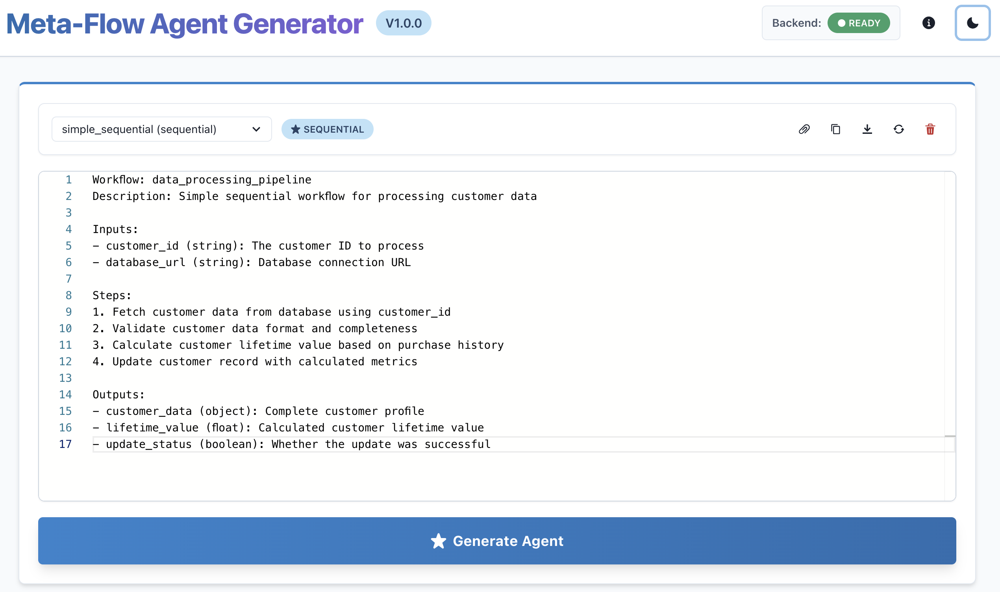

# Meta-Flow: Automated Workflow-to-Agent Code Generation

A system that transforms natural language workflow descriptions into executable Python agents using LLM-powered code generation.

## Project Overview

Meta-Flow is a dual-interface system offering two complementary tools:

1. **Meta-Agent (Workflow Generator)**: Direct text-to-code transformation for automated agent generation
2. **Chatbot (Interactive Assistant)**: Conversational interface for guided workflow creation with parameter collection

Both services operate in two phases:
- **Phase 1**: Converts text workflow specifications into structured JSON using LLMs
- **Phase 2**: Transforms JSON into executable Python agents with error handling and credential management

## Quick Start

### Docker Deployment (Recommended)

The easiest way to run Meta-Flow is using Docker with our interactive launcher script.

**Prerequisites:**
- Docker Engine 20.10+ and Docker Compose 2.0+ ([Install Docker](https://docs.docker.com/get-docker/))
- At least one LLM API key (Anthropic, AIMLAPI, or Gemini)

**Quick Start:**

```bash
# 1. Clone repository
git clone <your-repo-url>
cd meta-flow

# 2. Configure environment
cp .env.docker.example .env
# Edit .env and add your API key(s)

# 3. Launch services with interactive menu
./scripts/start.sh
```

The interactive menu will let you choose:
- **Meta-Agent** (Workflow Generator) - Ports 3001 (frontend) / 8000 (backend)
- **Chatbot** (Interactive Assistant) - Ports 3002 (frontend) / 8001 (backend)
- **Both services** - Run everything together

**Direct Script Access:**

If you prefer direct control without the menu:

```bash
# Meta-Agent only
./scripts/meta-agent-start.sh

# Chatbot only
./scripts/chatbot-start.sh

# Stop services (interactive menu)
./scripts/stop.sh

# Or stop directly
./scripts/meta-agent-stop.sh
./scripts/chatbot-stop.sh
```

### Service Access URLs

**Meta-Agent (Workflow Generator):**
- Frontend: http://localhost:3001
- Backend API: http://localhost:8000
- API Docs: http://localhost:8000/api/docs

**Chatbot (Interactive Assistant):**
- Frontend: http://localhost:3002
- Backend API: http://localhost:8001
- API Docs: http://localhost:8001/api/docs

### CLI Usage (No Docker)

For automation or CI/CD integration:

```bash
# Clone and setup
git clone https://github.com/a-dangelo/meta-flow.git
cd meta-flow
python3 -m venv venv
source venv/bin/activate
pip install -r requirements.txt

# Configure API key
echo "ANTHROPIC_API_KEY=your_api_key_here" > .env

# Generate an agent
python -m src.cli.complete_pipeline specs/examples/simple_sequential.txt
```

## Meta-Agent: Workflow Generator

The Meta-Agent provides a streamlined interface for converting text specifications directly into executable Python agents.

### Features

- **Three-Panel Layout**: Editor, visualizer, and output panels for comprehensive workflow management
- **Syntax Highlighting**: Color-coded specifications and generated code
- **Example Templates**: Pre-built workflow templates to get started quickly
- **Real-Time Generation**: Watch the pipeline transform specifications step-by-step
- **Dark Mode Support**: Professional interface suitable for extended usage
- **Multiple Output Formats**: View generated Python code, JSON AST, and metadata

### Main Editor Interface



The editor provides a clean interface for writing workflow specifications:
- **Workflow Type Selector**: Choose from sequential, conditional, parallel, or orchestrator patterns
- **Specification Editor**: Write natural language workflow descriptions with syntax highlighting
- **Generate Button**: One-click transformation to executable agent code
- **Backend Status**: Real-time connection status

### Generation Pipeline & Results


Watch your specification transform into code:
- **Progress Tracking**: Visual feedback for each pipeline stage
- **Generated Code**: Syntax-highlighted Python agent with proper structure
- **JSON AST Tab**: View the intermediate JSON representation
- **Metadata Tab**: Access generation details and configuration

## Chatbot: Interactive Workflow Assistant

The Chatbot provides a conversational interface that guides users through workflow creation with intelligent parameter collection and validation.


### Key Features

- **Natural Language Interface**: Describe workflows conversationally
- **Intelligent Parameter Collection**: Guided prompts for required workflow inputs
- **Workflow Library Matching**: Automatic detection of similar pre-built workflows (33 production-ready templates)
- **Real-Time Validation**: Immediate feedback on workflow structure and parameters
- **Visual Execution Tracking**: See workflow progress with step-by-step execution details
- **WebSocket-Based Communication**: Real-time updates and streaming responses

For detailed chatbot architecture and usage, see [Chatbot README](chatbot/README.md).

## Docker Architecture

Meta-Flow uses separate Docker Compose configurations for isolation and flexibility:

- `docker-compose.yml`: Meta-Agent service (ports 3001/8000)
- `docker-compose.chatbot.yml`: Chatbot service (ports 3002/8001)

Both configurations include:
- **Health Checks**: Automatic service monitoring and restart
- **Volume Mounts**: Hot-reload for specs and workflows during development
- **Network Isolation**: Dedicated networks for each service stack
- **Nginx Proxying**: Transparent API and WebSocket routing in frontend containers

### Docker Commands Reference

```bash
# Interactive launcher (recommended)
./scripts/start.sh          # Choose service via menu
./scripts/stop.sh           # Stop services via menu

# Direct service control
./scripts/meta-agent-start.sh    # Start meta-agent
./scripts/chatbot-start.sh       # Start chatbot
./scripts/meta-agent-stop.sh     # Stop meta-agent
./scripts/chatbot-stop.sh        # Stop chatbot

# Docker Compose (manual control)
docker compose up -d                              # Meta-Agent
docker compose -f docker-compose.chatbot.yml up -d  # Chatbot

# View logs
docker compose logs -f backend
docker compose -f docker-compose.chatbot.yml logs -f chatbot-frontend

# Rebuild (force clean build)
DOCKER_BUILD_NO_CACHE=1 ./scripts/meta-agent-start.sh
```

For complete script documentation, see [Scripts README](scripts/README.md).

## CLI Usage

The primary interface for automated workflows is the command-line interface.

### Basic Usage

```bash
python -m src.cli.complete_pipeline <specification_file> [options]
```

### Workflow Examples

```bash
# Sequential workflow - step-by-step data processing
python -m src.cli.complete_pipeline specs/examples/simple_sequential.txt

# Conditional workflow - expense approval with branching
python -m src.cli.complete_pipeline specs/examples/conditional_branch.txt

# Orchestrator pattern - support ticket routing
python -m src.cli.complete_pipeline specs/examples/orchestrator_example.txt

# Parallel execution - concurrent compliance checks
python -m src.cli.complete_pipeline specs/examples/parallel_example.txt

# Nested workflows - complex order fulfillment
python -m src.cli.complete_pipeline specs/examples/nested_workflow.txt
```

### Command-Line Options

| Option | Description | Example |
|--------|-------------|---------|
| `--verbose` | Enable detailed logging output | `--verbose` |
| `--validate-only` | Validate specification without generating code | `--validate-only` |
| `--output-dir` | Specify custom output directory | `--output-dir ./my_agents` |
| `--provider` | Select LLM provider (claude, aimlapi, gemini) | `--provider claude` |
| `--model` | Override default model | `--model claude-3-5-sonnet-20241022` |
| `--no-json` | Skip saving intermediate JSON | `--no-json` |

## Writing Specifications

Specifications follow a structured format:

```
Workflow: workflow_name
Description: Brief description of the workflow

Inputs:
- parameter_name (type): Description
- another_param (type): Description

Steps:
1. First step description
2. If condition, then action A
3. Otherwise, action B
4. Final step

Outputs:
- output_name (type): Description
```

### Supported Workflow Patterns

1. **Sequential**: Numbered steps executed in order
2. **Conditional**: If/then/else branching logic
3. **Parallel**: Steps marked as concurrent/simultaneous
4. **Orchestrator**: Multiple named sub-workflows with routing rules
5. **Nested**: Combinations of the above patterns

For detailed specification format and examples, see [REQUIREMENTS.md](REQUIREMENTS.md).

## Project Structure

```
meta-flow/
├── src/
│   ├── agents/              # Phase 1: LLM-based JSON generation
│   │   ├── graph.py         # LangGraph state machine
│   │   ├── nodes/           # Processing nodes (parse, reason, validate)
│   │   ├── providers.py     # LLM provider abstraction
│   │   └── models.py        # Pydantic schemas
│   ├── generators/          # Phase 2: Code generation
│   │   └── agent_generator.py  # JSON to Python transformation
│   ├── cli/                 # Command-line interface
│   │   └── complete_pipeline.py
│   └── tools/               # Tool library (33 production stubs)
├── api/                     # FastAPI backend (Meta-Agent)
│   └── main.py
├── frontend/                # React web interface (Meta-Agent)
├── chatbot/                 # Chatbot backend and core logic
│   ├── api/                # FastAPI endpoints
│   ├── src/                # Core modules
│   │   ├── conversation/   # LangGraph conversation flow
│   │   ├── workflow_matching/  # Library matching and retrieval
│   │   └── parameter_handling/ # Extraction, collection, validation
│   └── workflows/          # Workflow library (33 templates)
├── chatbot-frontend/       # React chatbot interface
├── specs/examples/         # Example workflow specifications
├── generated_agents/       # Output directory for generated agents
├── scripts/                # Service management scripts
├── docker-compose.yml      # Meta-Agent services
└── docker-compose.chatbot.yml  # Chatbot services
```

## Architecture

```
┌─────────────────────┐
│  Text Specification │  (Natural language workflow)
└──────────┬──────────┘
           │
    ┌──────▼──────────────────────┐
    │   PHASE 1: Meta-Agent       │
    │  ┌────────────────────┐     │
    │  │ Parser → Reasoner  │     │  (LangGraph + Claude Haiku 4.5)
    │  │    → Validator     │     │
    │  └────────────────────┘     │
    └──────────┬──────────────────┘
               │
        ┌──────▼──────┐
        │  JSON AST   │  (Structured workflow representation)
        └──────┬──────┘
               │
    ┌──────────▼──────────────────┐
    │  PHASE 2: Code Generator    │
    │  ┌────────────────────┐     │
    │  │  AST Traversal →   │     │  (Deterministic transformation)
    │  │  Python Generation │     │
    │  └────────────────────┘     │
    └──────────┬──────────────────┘
               │
        ┌──────▼──────────┐
        │  Python Agent   │  (Executable code with error handling)
        └─────────────────┘
```

## Environment Variables

Create a `.env` file in the project root:

```bash
# Required: At least one LLM provider key
ANTHROPIC_API_KEY=sk-ant-your-key-here
# OR
AIMLAPI_KEY=your-aimlapi-key
# OR
GEMINI_API_KEY=your-gemini-key

# Optional: Model configuration
ANTHROPIC_MODEL=claude-haiku-4-5
AIMLAPI_MODEL=x-ai/grok-4-fast-reasoning
GEMINI_MODEL=gemini-2.5-pro
```

## Troubleshooting

### Docker Services

**Backend fails to start:**
```bash
# Check logs
docker compose logs backend

# Verify API key is set
docker compose exec backend env | grep API_KEY

# Test health endpoint
curl http://localhost:8000/api/health
```

**Frontend can't connect to backend:**
```bash
# Check if both services are healthy
docker compose ps

# Test backend directly
curl http://localhost:8000/api/health
```

**Port already in use:**
```bash
# Change ports in docker-compose.yml:
# Frontend: Change "3001:80" to "3000:80"
# Backend: Change "8000:8000" to "8080:8000"
```

### CLI Issues

**Missing API key:**
```bash
# Ensure .env file exists and contains your key
cat .env  # Should show: ANTHROPIC_API_KEY=sk-ant-...
```

**Import errors:**
```bash
# Ensure virtual environment is activated
source venv/bin/activate  # Linux/macOS
venv\Scripts\activate     # Windows
```

**API key validation:**
```bash
# Test API key validity
python -c "from anthropic import Anthropic; c=Anthropic(); print('API key valid')"
```

## License

This project is licensed under **AGPL-3.0** - see the [LICENSE](LICENSE) file for details.

**What this means:**
- Free to use for personal and open source projects
- You can modify and redistribute
- If you use this in a web service, you must open-source your service too

---

**Note**: This is a proof-of-concept demonstrating the technical feasibility of automated agent generation. While functional and well-tested within its scope, production deployment would require additional hardening, observability, and scale testing.
